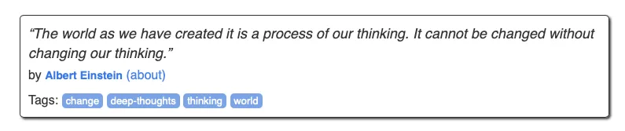
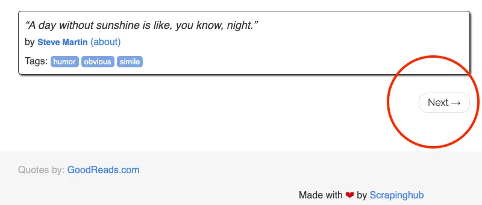

# NLP-Lesson-3-Scrapy
Scrapy Starter project

## Basic Setup

```bash
# 选择你的虚拟环境 from Python or Conda
# $ python3.6 -m venv venv
# $ source venv/bin/activate
# 安装依赖
$ pip install -r requirements.txt
```

## Target Website

[一个专门用于爬虫的站点](http://quotes.toscrape.com)



在一个网页tag上包含：

- 作者的名言
- 作者名
- 作者的标签

点击作者的名会进入作者详情页面，包含

- 作者的名称
- 作者的生日
- 作者的生平履历

## 项目编码流程

### Step1

创建项目

在`spiders`文件夹中创建新文件`quotes-spider.py`，用于向站点发送请求、

于scapy项目目录下，在命令行运行指令`scrapy crawl quotes`得到如下结果

```bash
2024-01-12 20:08:40 [scrapy.utils.log] INFO: Scrapy 2.11.0 started (bot: tutorial)
2024-01-12 20:08:40 [scrapy.utils.log] INFO: Versions: lxml 5.1.0.0, libxml2 2.12.3, cssselect 1.2.0, parsel 1.8.1, w3lib 2.1.2, Twisted 22.10.0, Python 3.9.18 (main, Sep 11 2023, 08:38:23) - [Clang 14.0.6 ], pyOpenSSL 23.3.0 (OpenSSL 3.1.4 24 Oct 2023), cryptography 41.0.7, Platform macOS-10.16-x86_64-i386-64bit
2024-01-12 20:08:40 [scrapy.addons] INFO: Enabled addons:
[]
2024-01-12 20:08:40 [asyncio] DEBUG: Using selector: KqueueSelector
2024-01-12 20:08:40 [scrapy.utils.log] DEBUG: Using reactor: twisted.internet.asyncioreactor.AsyncioSelectorReactor
2024-01-12 20:08:40 [scrapy.utils.log] DEBUG: Using asyncio event loop: asyncio.unix_events._UnixSelectorEventLoop
2024-01-12 20:08:40 [scrapy.extensions.telnet] INFO: Telnet Password: c0e271de13f34462
2024-01-12 20:08:40 [scrapy.middleware] INFO: Enabled extensions:
['scrapy.extensions.corestats.CoreStats',
 'scrapy.extensions.telnet.TelnetConsole',
 'scrapy.extensions.memusage.MemoryUsage',
 'scrapy.extensions.logstats.LogStats']
2024-01-12 20:08:40 [scrapy.crawler] INFO: Overridden settings:
{'BOT_NAME': 'tutorial',
 'FEED_EXPORT_ENCODING': 'utf-8',
 'NEWSPIDER_MODULE': 'tutorial.spiders',
 'REQUEST_FINGERPRINTER_IMPLEMENTATION': '2.7',
 'ROBOTSTXT_OBEY': True,
 'SPIDER_MODULES': ['tutorial.spiders'],
 'TWISTED_REACTOR': 'twisted.internet.asyncioreactor.AsyncioSelectorReactor'}
2024-01-12 20:08:40 [scrapy.middleware] INFO: Enabled downloader middlewares:
['scrapy.downloadermiddlewares.robotstxt.RobotsTxtMiddleware',
 'scrapy.downloadermiddlewares.httpauth.HttpAuthMiddleware',
 'scrapy.downloadermiddlewares.downloadtimeout.DownloadTimeoutMiddleware',
 'scrapy.downloadermiddlewares.defaultheaders.DefaultHeadersMiddleware',
 'scrapy.downloadermiddlewares.useragent.UserAgentMiddleware',
 'scrapy.downloadermiddlewares.retry.RetryMiddleware',
 'scrapy.downloadermiddlewares.redirect.MetaRefreshMiddleware',
 'scrapy.downloadermiddlewares.httpcompression.HttpCompressionMiddleware',
 'scrapy.downloadermiddlewares.redirect.RedirectMiddleware',
 'scrapy.downloadermiddlewares.cookies.CookiesMiddleware',
 'scrapy.downloadermiddlewares.httpproxy.HttpProxyMiddleware',
 'scrapy.downloadermiddlewares.stats.DownloaderStats']
2024-01-12 20:08:40 [scrapy.middleware] INFO: Enabled spider middlewares:
['scrapy.spidermiddlewares.httperror.HttpErrorMiddleware',
 'scrapy.spidermiddlewares.offsite.OffsiteMiddleware',
 'scrapy.spidermiddlewares.referer.RefererMiddleware',
 'scrapy.spidermiddlewares.urllength.UrlLengthMiddleware',
 'scrapy.spidermiddlewares.depth.DepthMiddleware']
2024-01-12 20:08:40 [scrapy.middleware] INFO: Enabled item pipelines:
[]
2024-01-12 20:08:40 [scrapy.core.engine] INFO: Spider opened
2024-01-12 20:08:41 [scrapy.extensions.logstats] INFO: Crawled 0 pages (at 0 pages/min), scraped 0 items (at 0 items/min)
2024-01-12 20:08:41 [scrapy.extensions.telnet] INFO: Telnet console listening on 127.0.0.1:6023
2024-01-12 20:08:45 [scrapy.core.engine] DEBUG: Crawled (404) <GET http://quotes.toscrape.com/robots.txt> (referer: None)
2024-01-12 20:08:45 [scrapy.core.engine] DEBUG: Crawled (200) <GET http://quotes.toscrape.com> (referer: None)
2024-01-12 20:08:46 [quotes] INFO: hello this is my first spider
2024-01-12 20:08:46 [scrapy.core.engine] INFO: Closing spider (finished)
2024-01-12 20:08:46 [scrapy.statscollectors] INFO: Dumping Scrapy stats:
{'downloader/request_bytes': 450,
 'downloader/request_count': 2,
 'downloader/request_method_count/GET': 2,
 'downloader/response_bytes': 11504,
 'downloader/response_count': 2,
 'downloader/response_status_count/200': 1,
 'downloader/response_status_count/404': 1,
 'elapsed_time_seconds': 4.75622,
 'finish_reason': 'finished',
 'finish_time': datetime.datetime(2024, 1, 12, 12, 8, 46, 30082, tzinfo=datetime.timezone.utc),
 'log_count/DEBUG': 5,
 'log_count/INFO': 11,
 'memusage/max': 54034432,
 'memusage/startup': 54034432,
 'response_received_count': 2,
 'robotstxt/request_count': 1,
 'robotstxt/response_count': 1,
 'robotstxt/response_status_count/404': 1,
 'scheduler/dequeued': 1,
 'scheduler/dequeued/memory': 1,
 'scheduler/enqueued': 1,
 'scheduler/enqueued/memory': 1,
 'start_time': datetime.datetime(2024, 1, 12, 12, 8, 41, 273862, tzinfo=datetime.timezone.utc)}
2024-01-12 20:08:46 [scrapy.core.engine] INFO: Spider closed (finished)
```
基于函数`response.xpath(“//div[@class=’quote’]”).get()`读取每一个页面tag的HTML标签
基于如下函数获取tag中的信息,注意运行在shell中

``` bash
>>> scrapy shell http://quotes.toscrape.com/
>>> quotes = response.xpath("//div[@class='quote']")
>>> quotes[0].css(".text::text").getall()
['“The world as we have created it is a process of our thinking. It cannot be changed without changing our thinking.”']
>>> quotes[0].css(".author::text").getall()
['Albert Einstein']
>>> quotes[0].css(".tag::text").getall()
['change', 'deep-thoughts', 'thinking', 'world']
```

上述代码中分别使用了xpath的语法和css的语法，仅作为展示用途

通过在执行命令行命令时增加一个标签的方式使用json文件进行存储
```bash
scrapy crawl quotes -o quotes.json
```

观察页面后，你可以看到页面的下端有一个 `next` 按钮用于跳页



通过css指令找到对应的按钮

```bash
$ scrapy shell http://quotes.toscrape.com/
...
>>> response.css('li.next a::attr(href)').get()
'/page/2/'
```

`next_page = response.urljoin(next_page)` 用于获取完整的URL地址

`yield scrapy.Request(next_page, callback=self.parse)` 用于发送一个新请求以获取下一页，并使用回调函数调用相同的解析函数以从新页面获取内容

```phthon
for a in response.css('li.next a'):
            yield response.follow(a, callback=self.parse)
``` 

使用`response.follow`函数可以更快地简化这一过程

我们也希望获取每一个作者的更详细信息，可以使用如下的bash
```bash
$ scrapy shell http://quotes.toscrape.com/
...
>>> response.css('.author + a::attr(href)').get()
'/author/Albert-Einstein'
```

而使用代码的方式，我们可以将这一过程循环化,在提取每个引用的循环中，发出另一个请求，转到相应作者的页面，并创建另一个 parse_author 函数来提取作者的姓名、生日、出生地点和简介，并将其输出到控制台

```python
def parse(self, response):
        # self.logger.info('hello this is my first spider')
        quotes = response.css('div.quote')
        for quote in quotes:

            yield {
                'text': quote.css('.text::text').get(),
                'author': quote.css('.author::text').get(),
                'tags': quote.css('.tag::text').getall(),
            }

            author_url = quote.css('.author + a::attr(href)').get()
            self.logger.info('get author page url')
            # go to the author page
            yield response.follow(author_url, callback=self.parse_author)

        for a in response.css('li.next a'):
            yield response.follow(a, callback=self.parse)


    def parse_author(self, response):
        yield {
            'author_name': response.css('.author-title::text').get(),
            'author_birthday': response.css('.author-born-date::text').get(),
            'author_bornlocation': response.css('.author-born-location::text').get(),
            'author_bio': response.css('.author-description::text').get(),
        }
```

**Question：What is the issue**

### Step2 

Todo